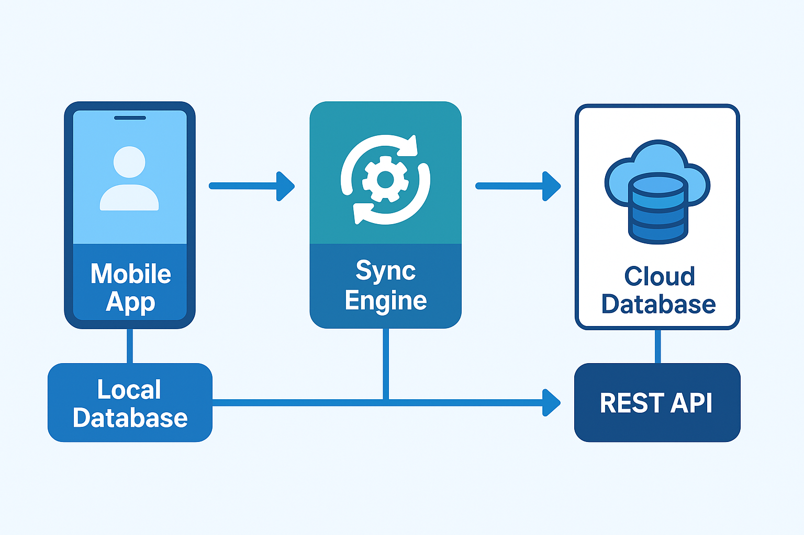
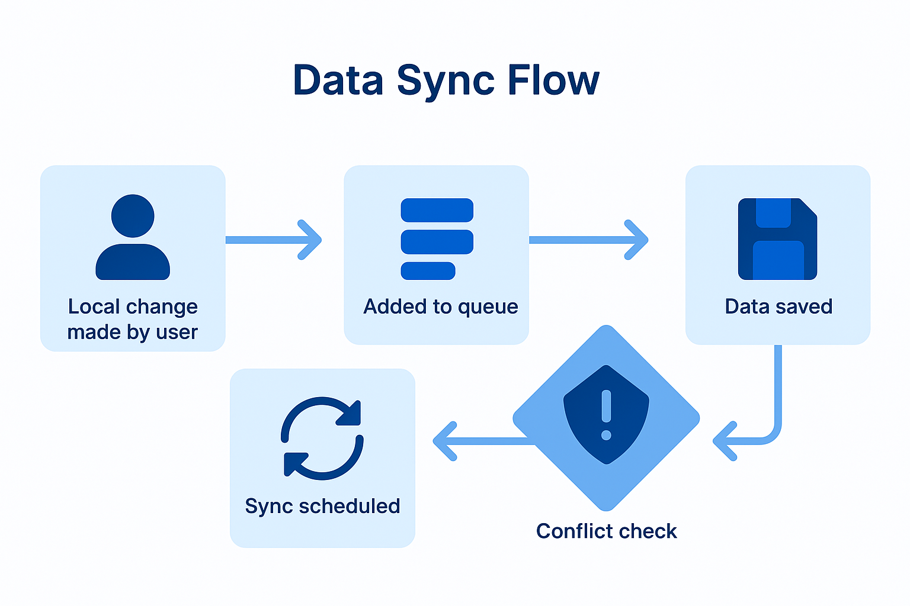

# Modern iOS Offline-First Sync Engine (Vector Clock Implementation)

## 📌 Project Overview

This project is a high-performance **Offline-First Synchronization Engine** for iOS, developed as the core practical component of my MSc Thesis in Enterprise Software Systems at SETU, Ireland. 

The engine addresses one of the most challenging aspects of mobile engineering: **maintaining data consistency across multiple devices in unstable network environments.** By implementing custom **Vector Clock (VV)** algorithms and an **AWS Serverless** backend, the system achieves eventual consistency while optimizing network overhead.

---

## 🛠 System Architecture & Data Flow

The architecture bridges the gap between local reactive persistence (Realm) and cloud-scale infrastructure (AWS). It ensures that data modifications originating from any device are tracked via logical timestamps rather than fragile physical system clocks.

**data-flow**

### Cloud Stack:
* **Amazon API Gateway**: RESTful entry point for sync requests.
* **AWS Lambda**: Stateless execution of conflict detection and resolution logic.
* **Amazon DynamoDB**: NoSQL storage for global version vectors and task entities.

---

## 🚀 Key Technical Highlights

### 1. Advanced Conflict Resolution (`ConflictResolver.swift`)
The system implements a sophisticated **Vector Clock** mechanism to track causal relationships between updates:
* **Causal Ordering**: Automatically merges updates that have a clear "happened-before" relationship.
* **Concurrent Detection**: Accurately identifies overlapping modifications (Conflicting states) that require manual resolution.
* **Granular Merging**: Supports field-level versioning (e.g., merging `Title` and `Content` independently based on their respective version vectors).

### 2. Scalable Sync Strategies (`SyncStrategy.swift`)
I utilized the **Strategy Pattern** to decouple synchronization logic, allowing the App to switch between:
* **Delta Synchronization**: Transmits only modified entities based on the `lastSyncTime`, reducing data payload by **~70%** in real-world scenarios.
* **Full Synchronization**: A robust baseline to ensure total state convergence.

### 3. Reactive Mobile Core
* **Local Persistence**: Integrated **Realm Swift** for fine-grained object notifications and thread-safe data handling.
* **Reactive UI**: Built with **SwiftUI** and **Combine**, ensuring the UI remains responsive and reflects sync states (Syncing, Conflict, Success) in real-time.

---

## 🔍 Core Code Exploration

* **`ConflictResolver.swift`**: The heart of the system. It compares local vs. remote version vectors to determine if a state is `localNewer`, `remoteNewer`, or `concurrent`.
* **`DeltaSyncStrategy.swift`**: Implemented incremental data fetching and uploading, drastically improving performance in low-bandwidth environments.
* **`ConflictCenter.swift`**: A centralized manager for handling pending conflicts, allowing users to manually resolve concurrent edits via a dedicated UI.

---

## 📈 Research Findings (from Thesis)

* **Bandwidth Efficiency**: Delta synchronization reduced network traffic by **over 70%** compared to traditional full-state replication.
* **Consistency Reliability**: Vector Clocks achieved **100% accuracy** in tracking causal order across 3+ concurrent devices, whereas the baseline LWW (Last-Write-Wins) strategy suffered from frequent "lost updates" due to clock skew.

---

## ⚙️ Installation & Requirements

* **iOS**: 17.0+ / Xcode 15.0+
* **Dependencies**: Realm Swift (via Swift Package Manager).
* **Backend**: Requires an AWS environment (Lambda functions and DynamoDB tables configured according to the thesis specifications).

---

### 👨‍💻 About the Author
**Senior iOS Engineer (7+ Years Experience)** Specializing in modular architecture, performance optimization, and mobile-cloud integration. This project demonstrates my ability to translate complex distributed systems theory into production-ready mobile code.
